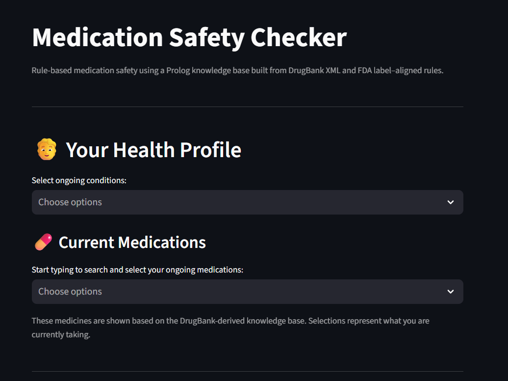
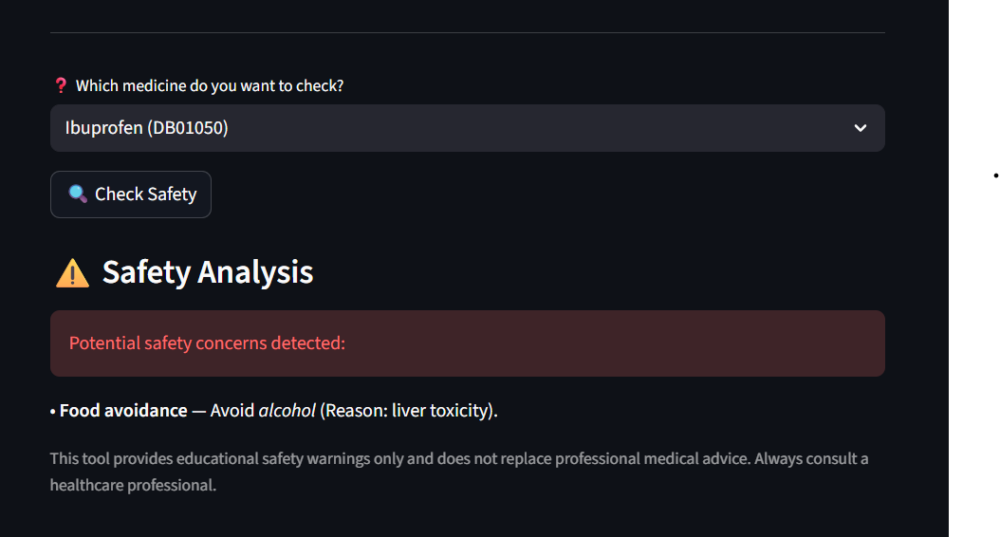
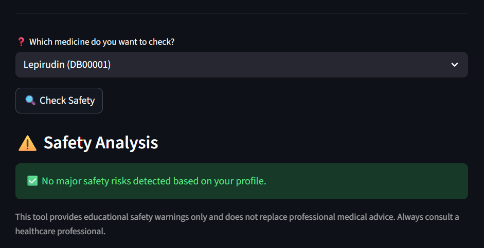
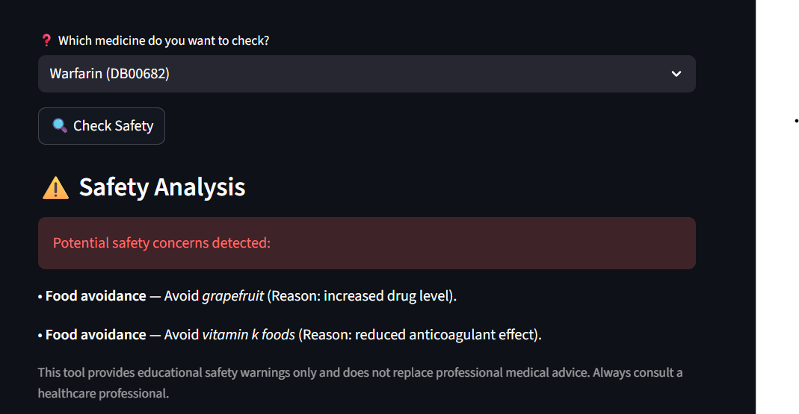
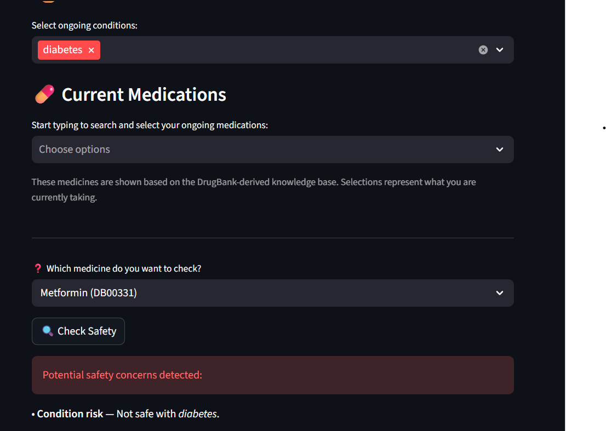
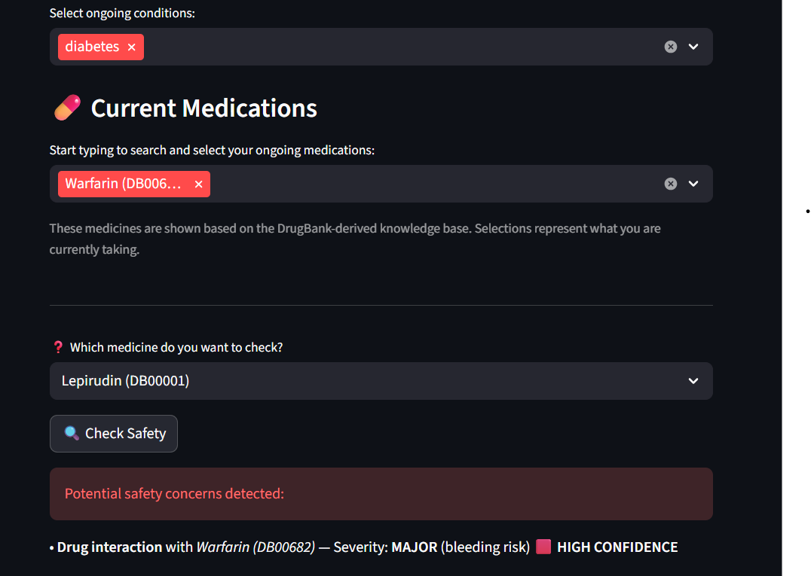
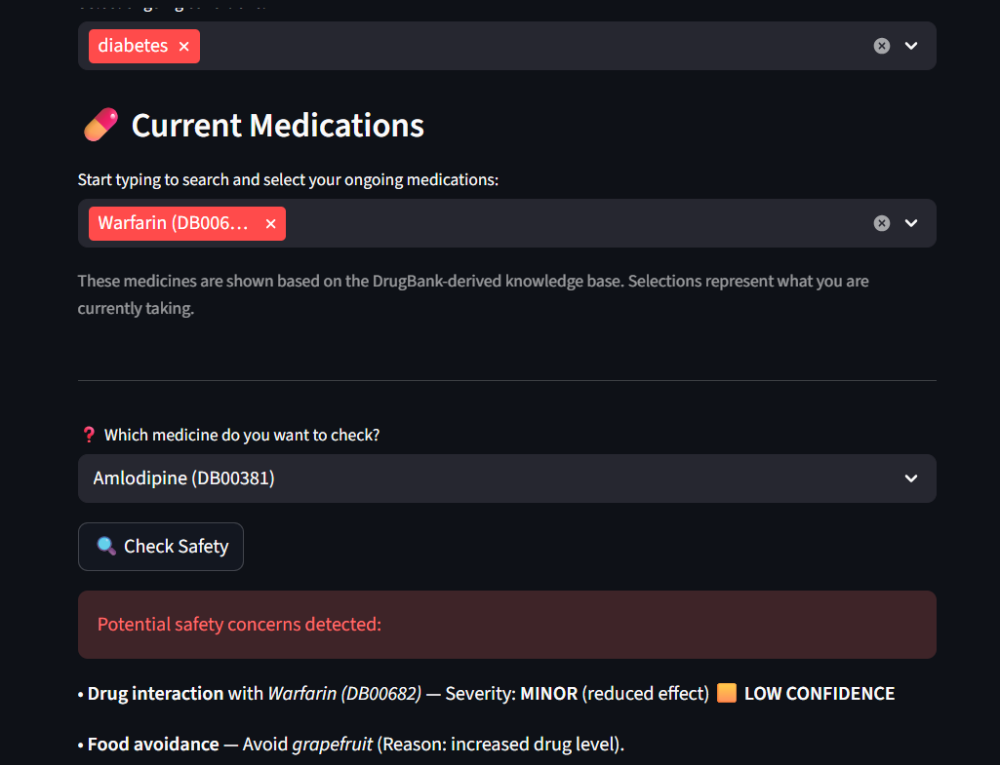
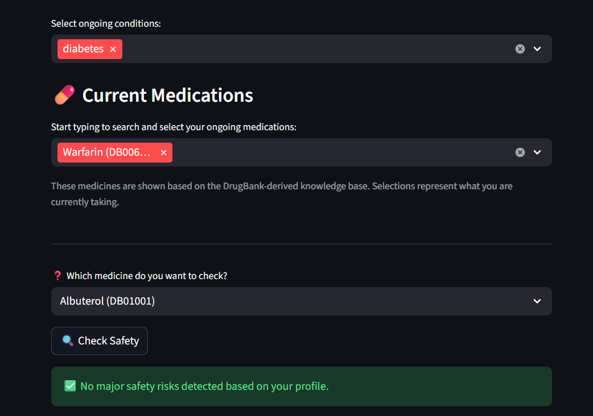

# MedSafe KnowledgeBase  
Clinical Safety Reasoning & Medication Interaction Engine

A knowledge-based clinical safety reasoning system built using **Prolog and symbolic AI**, designed to detect **drug–drug, drug–food, drug–condition, and class-based interactions** with explainable logic.

The system leverages a curated medical knowledge base (inspired by DrugBank and FDA data) and rule-based inference to provide **transparent, auditable, and explainable medication safety checks**, making it suitable for academic research, healthcare decision support, and AI reasoning demonstrations.

---

## Table of Contents

- [Overview](#overview)
- [Features](#features)
- [System Architecture](#system-architecture)
- [Installation](#installation)
- [Usage](#usage)
- [Conclusion](#conclusion)

---

## Overview

### Clinical Safety Focus  
- Identifies unsafe medication combinations using symbolic reasoning rather than black-box ML.

### Knowledge Representation & Reasoning (KRR)  
- Encodes medical knowledge using **facts, rules, and logical inference** in Prolog.

### Explainable AI  
- Every safety warning is traceable to explicit rules and facts.
- Designed to support explainability for clinicians, students, and auditors.

### Multi-Dimensional Safety Checks  
- Covers multiple clinical dimensions:
  - Drug–Drug interactions
  - Drug–Food interactions
  - Drug–Condition contraindications
  - Drug Class–Class interactions (optional)

### Research-Oriented Design  
- Clean separation between **facts** and **rules**
- Suitable for experimentation, extension, and academic evaluation

---

## Features

### 1️⃣ Drug–Drug Interaction Detection
- Identifies harmful combinations between medications
- Supports severity levels and explanatory output

### 2️⃣ Drug–Food Safety Analysis
- Flags foods that may alter drug efficacy or increase risk
- Avoids over-warning by isolating direct food interactions

### 3️⃣ Drug–Condition Contraindications
- Detects medications unsafe for specific medical conditions
- Enables personalized safety checks based on patient context

### 4️⃣ Class-Based Interaction Reasoning
- Uses pharmacological classes to infer indirect risks
- Optional abstraction layer for scalable reasoning

### 5️⃣ Normalization & Robust Query Handling
- Accepts multiple input formats (IDs, names, case-insensitive)
- Prevents contradictory or duplicated reasoning paths

### 6️⃣ Explainable Output for UI Integration
- Designed to integrate with a frontend or chatbot
- Outputs structured explanations suitable for user interfaces

## Screenshots

The following screenshots illustrate the dashboard’s functionality:
## Screenshots

### Medication Safety Checker – Overview

*Main interface of the MedSafe KnowledgeBase, where users define their health profile, ongoing medications, and select a target medicine for safety analysis using a Prolog-based reasoning engine.*

---

### Food–Drug Safety Warning (Ibuprofen)

*Example showing a food–drug safety warning for Ibuprofen, where alcohol is flagged due to increased risk of liver toxicity. The warning is derived from explicit food–drug rules in the knowledge base.*

---

### No-Risk Safety Outcome (Lepirudin)

*Case demonstrating a safe outcome when no applicable drug, food, or condition-based risks are detected for the selected medicine and user profile.*

---

### Food–Drug Interactions (Warfarin)

*Warfarin safety analysis highlighting multiple food-based risks, including grapefruit (increased drug level) and vitamin K–rich foods (reduced anticoagulant effect).*

---

### Condition-Based Contraindication (Diabetes)

*Condition-based reasoning example where a selected medicine is flagged as unsafe due to an existing condition (diabetes), demonstrating personalized safety checks.*

---

### Major Drug–Drug Interaction Detection

*Detection of a major drug–drug interaction involving Warfarin, labeled with severity and confidence level, illustrating explainable interaction reasoning.*

---

### Minor Drug–Drug Interaction with Food Risk

*Example of a minor drug–drug interaction combined with a food avoidance recommendation, showing multi-dimensional safety reasoning.*

---

### Safe Outcome with Chronic Condition Present

*Final example where no major safety risks are detected despite an existing condition and ongoing medication, demonstrating rule-based precision and avoidance of over-warning.*

---
## Dataset & Licensing Notice

- ⚠️ Large datasets (e.g., DrugBank XML) are NOT included in this repository due to:

- Size constraints

- Licensing restrictions

## Conclusion

The MedSafe KnowledgeBase demonstrates how symbolic AI and knowledge-based reasoning can be applied to real-world healthcare safety problems.

Unlike purely statistical models, this system emphasizes:

- Transparency

- Explainability

- Clinical traceability

- Research extensibility

- It serves as a strong foundation for:

- AI in Healthcare research

- Explainable AI (XAI) demonstrations

- Clinical decision support prototypes

- Integration with LLM-based healthcare assistants

### Author: Yash Savaliya
- Project Type: Knowledge Representation & Reasoning (KRR)
- Domain: Clinical Safety & Medication Intelligence
- Date: December 2025
